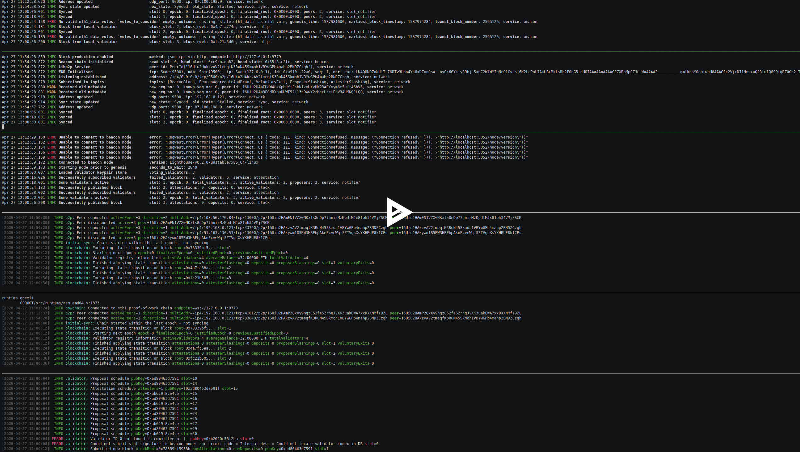

# Schlesi ETH 2.0 Testnet
Documentation of the Ethereum 2.0 phase-0 beacon-chain multi-client testnet efforts.

_This is work in progress._
- Deposit contract: `0xA15554BF93a052669B511ae29EA21f3581677ac5` ([Goerli Testnet](https://github.com/goerli/testnet))
- Current ETH 2.0 specification version support:
  - [x] v0.10.1 (moved to `.trash/`)
  - [x] v0.11.1
  - [ ] v0.12.x

### `v0.11.1`
This repository contains the client configuration files and genesis state for the `v0.11.1` Ethereum 2.0 specification multi-client testnet _"Schlesi v0.11"_ for the following clients:
- [ ] Cortex
- [x] Lighthouse [light/](light/)
- [ ] Lodestar
- [ ] Nimbus
- [x] Prysm [prysm/](prysm/)
- [ ] Teku [teku/](teku/) _(WIP)_
- [ ] Trinity

Known issues:
- [ ] Spec: [clarify that eth1 timestamp can be less than min genesis time #1756](https://github.com/ethereum/eth2.0-specs/pull/1756)
- [ ] Ligthhouse: [Eth1 genesis time is incorrect #1051](https://github.com/sigp/lighthouse/issues/1051)
- [x] ~~Prysm: [Prysm launches beacon chain 1 hour before Lighthouse #5616](https://github.com/prysmaticlabs/prysm/issues/5616)~~
- [ ] Teku: [Unable to peer with Lighthouse or Prysm #1666](https://github.com/PegaSysEng/teku/issues/1666)
- [ ] Prysm: [Do not reject peers if --p2p-max-peers is reached #5588](https://github.com/prysmaticlabs/prysm/issues/5588)
- [ ] Prysm: [Failed to handle p2p RPC error=rate limited #5587](https://github.com/prysmaticlabs/prysm/issues/5587)
- [ ] Lighthouse: [Beacon Node: Unable to recover from network fragmentation #949](https://github.com/sigp/lighthouse/issues/949)

Clients will be added one by one if they manage to connect, synchronize, and stay in consensus. _Work in progress._

### ~~[`v0.10.1`](.trash/v0-10-1)~~
This repository contains the client configuration files and genesis state for the `v0.10.1` Ethereum 2.0 specification multi-client testnet _"Schlesi v0.10"_ in [`.trash/v0-10-1`](.trash/v0-10-1).

Supported clients:
- [ ] Cortex (C#, Nethermind)
- [x] Lighthouse (Rust, Sigma Prime)
- [ ] Lodestar (TypeScript, ChainSafe)
- [ ] Nimbus (Nim, Status)
- [ ] Prysm (Go, Prysmatic Labs)
- [x] Teku (Java, PegaSys Engineering)
- [ ] Trinity (Python, Ethereum Foundation)

~~Clients will be added one by one if they manage to connect, synchronize, and stay in consensus.~~ _Moved on to v0.11.1._

### F.A.Q.
_I'm wondering why ..._

##### Why do we need multi-client test-networks?
The first phase of Ethereum 2.0, the phase 0, is the beacon chain. For the first time, a variety of new clients will be working together on a brand new blockchain with a new, unique approach to networking and consensus.

Before such a mainnet can be launched, we need testnets that mimic mainnet conditions as good as possible. This requires us to have stable, long-term, and persistent testnets up and running that are supported by not only one client but multiple clients, ideally, all clients.

The Schlesi testnet is one of many steps in that direction.

##### Is _Schlesi_ an incentivized adversarial network?
No. The Schlesi testnet is not incentivized. The current goal is to ensure protocol compatibility across major ETH 2.0 client implementations. Participation is free and permissionless, everyone can create validator deposits at [`0xA15554BF93a052669B511ae29EA21f3581677ac5`](https://goerli.etherscan.io/address/0xA15554BF93a052669B511ae29EA21f3581677ac5) on the _Goerli_ Ethereum testnet and start validating on Schlesi.

##### What's the difference between Schlesi and _Interop_?
The [ETH 2.0 Interop Lock-In](https://blog.ethereum.org/2019/09/19/eth2-interop-in-review/) was a physical meetup of seven client teams working towards interoperability in 2019. This was the first major step towards multi-client testnets, even though the focus of the lock-in was mainly on networking. Other aspects of interoperability were playing minor roles.

For Schlesi, _all_ aspects are important, as they would be important for a potential mainnet candidate.

##### What's the difference between Schlesi and _Multinet_?
The [ETH 2.0 Multinet](https://github.com/eth2-clients/multinet) is a collection of startup scripts to simulate multi-client testnets with various parameters such as number of validators to run the network with. The multinet is based on a minimal ETH 2.0 specification.

Schlesi, however, is _not_ a simulation. It's a real persistent end-user testnet based on a slightly modified mainnet configuration. Everyone should be able to add validators and beacon chain nodes.

##### Why does Schlesi use the _Mainnet_ configuration?
The ultimate goal of Schlesi should be proving that the clients are ready to support a potential beacon-chain mainnet. Therefore, it is time to template the testnet as close as possible to mainnet.

##### Why is there no docker file or startup script?
The focus of the testnet is no longer developer but end-user centric. Each user of the beacon chain should be able to manually complete any task, i.e., setting up a validator or synchronizing a beacon chain node. Scripts will be convenient in future to ease this process but for now we need to ensure that nodes, clients, and other tooling is ready to be used sufficiently to complete all tasks required by a beacon chain mainnet.

Additionally, not having a script that does the job for you, ensures that all node implementations and their according tooling are well documented across the different clients.

##### Why do you call it _Schlesi_?
Schlesi (Schlesisches Tor) is a subway station in Berlin with proximity to _Goerli_ and _Full Node_.

##### What is the _Goerli_ testnet?
Goerli is a cross-client proof-of-authority [Ethereum 1.x testnet](https://github.com/goerli/testnet). It's well supported across all ETH 1.0 clients, tooling, and infrastructure, and will be used to test the ETH 2.0 transition through a deposit contract deployed to Goerli.

### See also
Resources:
- [Notes: Longstanding MC-testnet(s)](https://notes.ethereum.org/DLu2WPtDSMOeNlnBth03Dw)
- [Article: How to run your own Beacon Chain](https://dev.to/q9/how-to-run-your-own-beacon-chain-e70)
- [Stack Exchange: What does the beacon chain deposit contract ceremony entail?](https://ethereum.stackexchange.com/questions/80258/what-does-the-beacon-chain-deposit-contract-ceremony-entail)
- [Stack Exchange: How would a chain specification for a beacon chain look like?](https://ethereum.stackexchange.com/questions/80264/how-would-a-chain-specification-for-a-beacon-chain-look-like)

In the news:
- [Ethereum 2.0's Phase 0 multiclient testnets will likely go live in April](https://www.theblockcrypto.com/post/60292/ethereum-2-0s-phase-0-multiclient-testnets-will-likely-go-live-in-april-predicts-buterin)

Historical documentation:
- [Gist: Schlesi ETH 2.0 Multi-Client Testnet configuration](https://gist.github.com/q9f/d6eea3ea3356e41bde81864143284ce9)
- [Field notes: Towards a multi-client Ethereum 2.0 testnet](https://hackmd.io/GIwaFeGaQn6q7VYb_n94LA)
- [Call: EF Research & Görli Testnet “Multi-Client Testnet for ETH 2.0”](https://hackmd.io/Nx204wkTSgeGB0UzNXhz9g)

Previous multi-client testnets:
- [Github: eth2-clients/multinet](https://github.com/eth2-clients/multinet)
- [Github: eth2-clients/eth2-testnets](https://github.com/eth2-clients/eth2-testnets)

### License
This is free and unencumbered software released into the public domain. For more information, please refer to [unlicense.org](https://unlicense.org)
